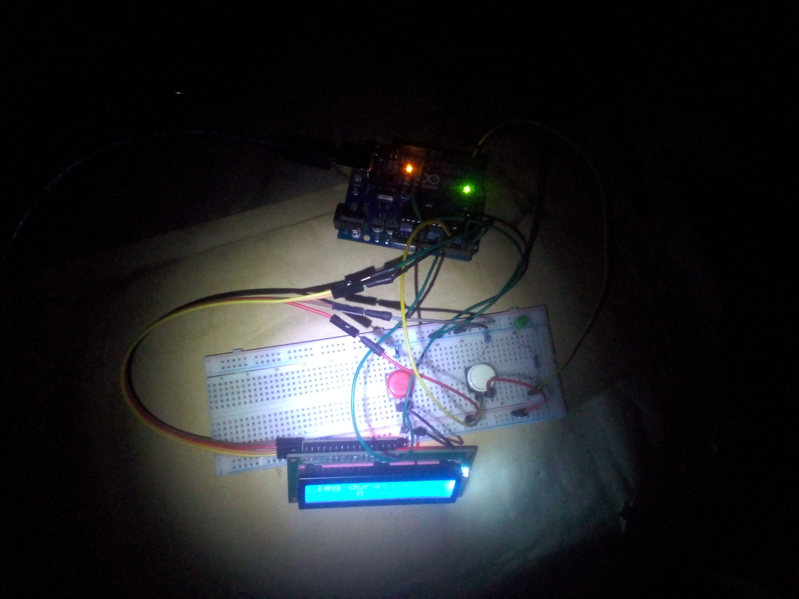

# mini reaction timer game---Arduino-Project

## Overview
This project is a mini reaction timer game built with Arduino. It uses a push button to start and stop a timer, an LED to indicate timing status, and an I2C LCD to display the elapsed time in seconds. A reset button allows the timer to be cleared at any moment.

## Objective
- Build a simple reaction timer game using Arduino
- Learn button state detection and toggle logic
- Display real-time timing information on an I2C LCD
- Use LEDs as visual indicators
- Implement reset functionality for game control

## Components Used
- Arduino Uno
- I2C LCD Display (16x2)
- LED
- Push buttons × 2 (Start/Stop, Reset)
- 220Ω resistor
- Breadboard
- Jumper wires
- 9V Battery
- 9V Battery Clip to DC Barrel Jack

## Circuit Diagram

For other images [CLICK HERE](images/)

## How It Works
1. The start/stop button toggles the LED state using edge detection logic.
2. When the LED is ON:
   - The timer starts counting in seconds.
   - The LCD displays the running timer value.
3. When the LED is OFF:
   - The LCD displays the last recorded LED ON duration.
4. The reset button clears the timer and resets the counter to zero.
5. The LCD updates every second and refreshes the display for clarity.

## Code
The Arduino sketch for this project is located in the [code/ directory](code/mini_reaction_timer_game_project_on_12th_November_2025).

## Demo Video
A demonstration video showing the game in action is included in this repository.

📹 **Project Demonstration:**  
[Click here to watch/download the demo video](https://youtu.be/EFLJiie3IBo)

*(If the video does not preview directly on GitHub, please download it using the link above.)*

## Reflection (What I Learned)
- Implementing button toggle logic using previous and current states
- Displaying dynamic values on an I2C LCD
- Managing timing using delays
- Designing simple interactive Arduino games

## Challenges Faced
- Handling button state changes reliably
- Preventing incorrect timer resets
- Managing LCD refresh without flickering

## Possible Improvements
- Replace delay-based timing with `millis()` for better accuracy
- Add random LED start delays to improve reaction testing
- Store and display best reaction time
- Add sound feedback using a buzzer

## Project Status
Completed
